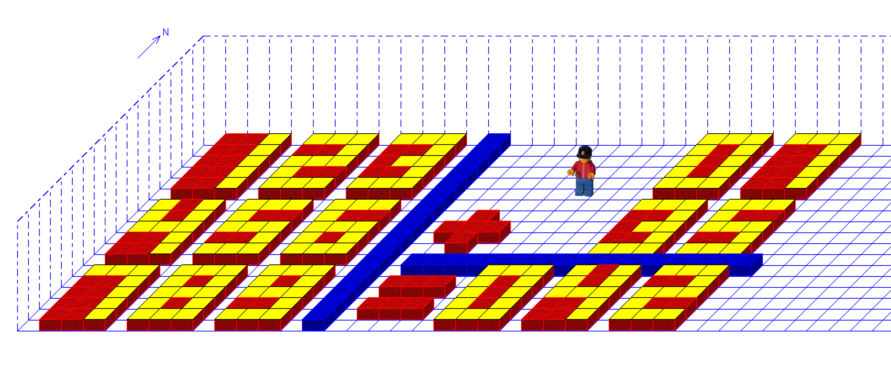

# Robot Carol Calculator
This is a very simple calculator written for/in RobotCarol, a program/language used to teach basic programming concepts to children. It was mainly written as a fun challenge in remembrance of a binary calculator I wrote in RobotCarol back in highschool, but I think it also shows quite well how much is possible even in a very simple language (RobotCarol is turing complete after all, at least if you had an infinite world).

## How to perform a calculation
1. Load the `world.kdw` world or run the `build_world.kdp` program in an empty world (width >= 47, height >= 17 and block height must be 10)
2. Write the two input numbers into the input fields in the world (use `0X` for 1-digit numbers e.g. `07`). The left side of the example world shows how the numbers should be written.
3. Modify the arithmetic operator in the world to the operation you want to perform (`+` for adding, `-` for subtracting, `x` for multiplication, `:` for division)
4. Run the `calc.kdp`program

